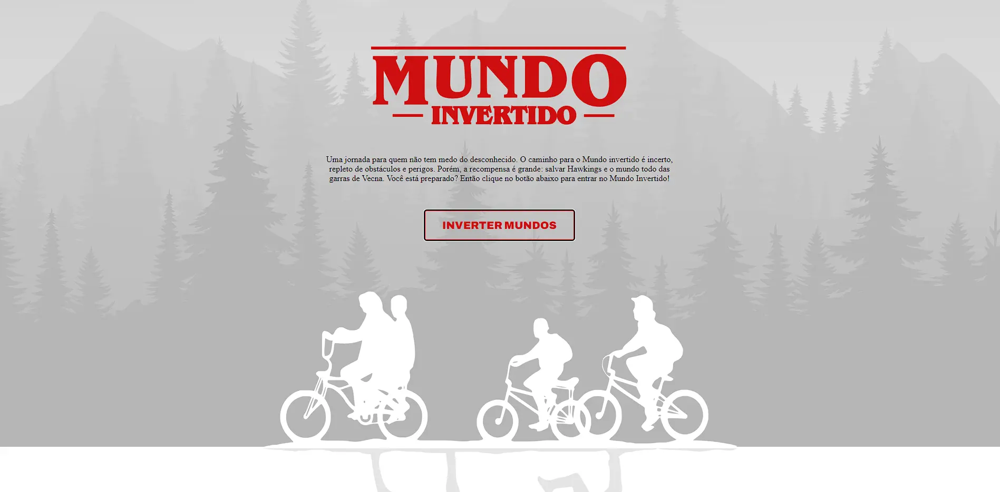

<h1 align="center"> Stranger things </h1>

Projeto mundo invertido promovido pela DIO.  

  <a href="#-tecnologias">Tecnologias</a>&nbsp;&nbsp;&nbsp;|&nbsp;&nbsp;&nbsp;
  <a href="#-projeto">Projeto</a>&nbsp;&nbsp;&nbsp;

 

  

## 🚀 Tecnologias

Esse projeto foi desenvolvido com as seguintes tecnologias:

- HTML e CSS
- JavaScript
- Git e Github

## 💻 Projeto

Mundo invertido é um projeto inspirado na série stranger things onde clicando para inverter você tem a experiência dos dois mundos.

- [Acesse o projeto finalizado](https://gabtech1.github.io/Stranger-things-DIO/)
